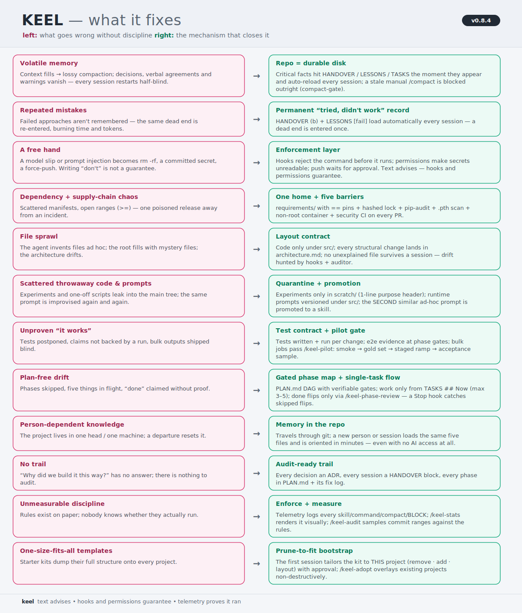
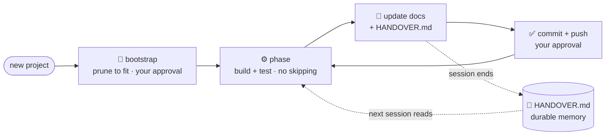
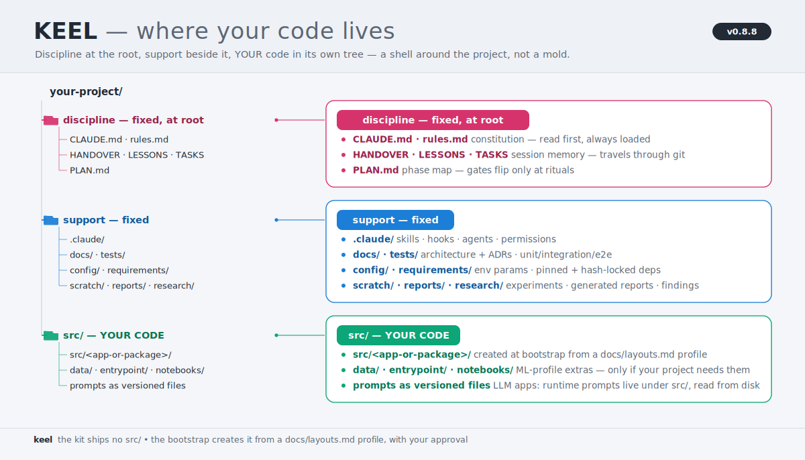
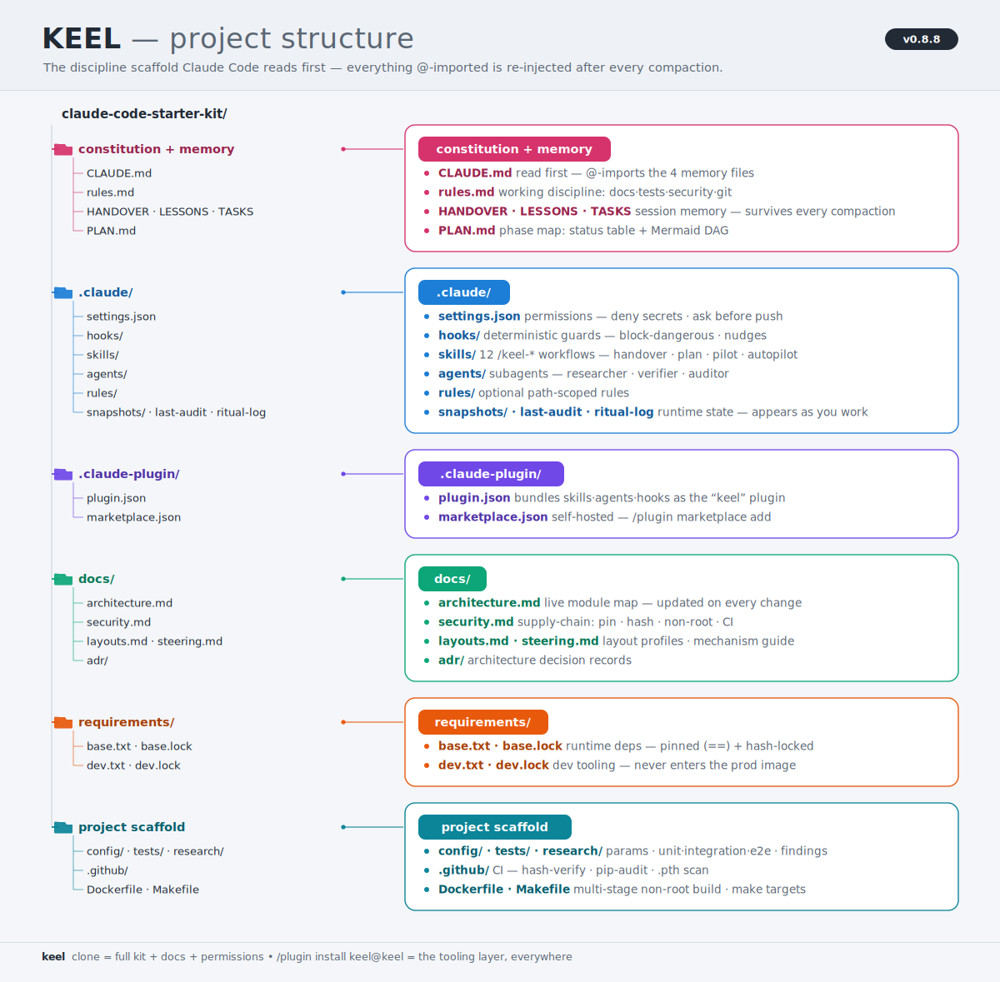

# Keel — Claude Code Starter Kit

*Like a ship's keel keeps a vessel on course, **Keel** keeps Claude Code (or any LLM) on course:
a discipline + security starter kit that makes your project consistent, traceable, and safe —
no drift across sessions, from the very first one.*

<p align="center">
  
</p>

**Requires:** [Claude Code](https://claude.com/claude-code). The `.claude/` layer (permissions, hooks,
skills) is Claude-Code-native; the docs and discipline (`rules.md`, ADRs, `HANDOVER.md`, security guide)
are tool-agnostic and useful with any agent.

## Quick start
```bash
# 1) clone Keel as your new project, then start your own git history
git clone https://github.com/muratsilahtaroglu/claude-code-starter-kit.git my-project
cd my-project && rm -rf .git && git init
# 2) in Claude Code, let it tailor the template to THIS project before coding:
#    "Read CLAUDE.md, then run the bootstrap: prune what this project doesn't need and plan."
```
Shell commands in this README are for **macOS/Linux** — on Windows use **Git Bash** (Claude Code uses it
there anyway); the PowerShell equivalent of `rm -rf .git` is `Remove-Item -Recurse -Force .git`.

Not every project needs the whole template — the bootstrap prunes it to fit (with your approval).
See **How to use** below. **Already have a project?** Don't `rm -rf .git` — see
[Adopting into an existing project](#adopting-into-an-existing-project-brownfield).

### Or install just the tooling as a plugin
This repo is **also its own Claude Code plugin marketplace** — install the enforcement layer without cloning:
```text
/plugin marketplace add muratsilahtaroglu/claude-code-starter-kit
/plugin install keel@keel
```
That gives you the **skills** (each `keel-`-prefixed, so under the plugin namespace: `/keel:keel-handover` ·
`/keel:keel-distill` · `/keel:keel-phase-review` · `/keel:keel-research` · `/keel:keel-adopt` ·
`/keel:keel-update` · `/keel:keel-audit` · `/keel:keel-plan` · `/keel:keel-compact` ·
`/keel:keel-stats` · `/keel:keel-pilot`), the `researcher` +
`verifier` + `auditor` **subagents**, and the
memory/safety **hooks** — across every repo. **A clone is a snapshot; the plugin is a subscription:**
when the template improves, one `/plugin marketplace update keel` brings the new tooling to *all* your
projects at once — no re-cloning. It does **not** install the discipline docs (`rules.md`,
`HANDOVER/LESSONS/TASKS`, `docs/`) or the `.claude/settings.json` permissions (plugins can't seed repo
files or permission rules). The clone above is the full kit; the plugin is the tooling half for teams
that already have the docs or want the skills everywhere.

**Team auto-install (plugin-only projects):** commit these two keys to the project's
`.claude/settings.json` and everyone who opens the repo gets the keel tooling registered and enabled
automatically — no per-person `/plugin marketplace add` + `/plugin install`:
```json
{
  "extraKnownMarketplaces": {
    "keel": { "source": { "source": "github", "repo": "muratsilahtaroglu/claude-code-starter-kit" } }
  },
  "enabledPlugins": { "keel@keel": true }
}
```
Don't add this to a **full clone** of the kit — the clone already registers the same hooks via
`.claude/settings.json`, and plugin + settings registration together fire each hook twice (the
dual-registration note in `docs/steering.md`).

**Updating a cloned kit** works the same reviewed way: run **`/keel-update`** in the project — it fetches the
latest template, skips what your bootstrap pruned, and shows the rest as diffs: kit tooling in one
reviewed batch, likely-tailored files (`rules.md`, config, workflows) hunk-by-hunk. Only hunks you
approve are applied; your project memory (`HANDOVER/LESSONS/TASKS`), your code, and the project-owned
docs (`CLAUDE.md`, architecture, ADRs) are never touched.

> **Purpose:** When starting a new project (you or your teammates), give Claude Code this folder as a
> **template**. The generic "working discipline" files inside help set up the project from day one as
> **professional, traceable, and secure**. No file contains a project name or project-specific detail —
> fill in the placeholders.

## What Keel fixes (problem → mechanism)

The whole kit in one picture — left, what goes wrong in long AI-assisted projects; right, the concrete
mechanism that closes it:

<p align="center">
  
</p>

<sub>Generated from [`docs/assets/gen_architecture_svg.py`](docs/assets/gen_architecture_svg.py) (the `FIXES` list) — same data-driven pipeline as the structure maps.</sub>

<details>
<summary><b>Text version</b> (searchable)</summary>

| Without Keel | With Keel — the mechanism |
|---|---|
| **Volatile memory.** The context window fills and the conversation is compacted into a lossy summary — decisions, verbal agreements and warnings vanish; every session restarts half-blind. | **Repo = durable disk.** Critical facts hit `HANDOVER` / `LESSONS` / `TASKS` the moment they appear and auto-reload every session; a stale manual `/compact` is **blocked outright** (compact-gate). |
| **Repeated mistakes.** Failed approaches aren't remembered — the same dead end is re-entered, burning time and tokens. | **Permanent "tried, didn't work" record.** HANDOVER (b) + `LESSONS [fail]` load automatically every session — a dead end is entered once. |
| **A free hand.** A model slip or prompt injection becomes `rm -rf`, a committed secret, a force-push. Writing "don't" is not a guarantee. | **Enforcement layer.** Hooks reject the command before it runs, permissions make secrets unreadable, push waits for approval. Text advises; hooks and permissions **guarantee**. |
| **Dependency chaos + supply-chain risk.** Scattered manifests, open ranges (`>=`) — one poisoned release away from an incident. | **One home + five barriers.** Everything in `requirements/` (base/dev); `==` pins + hashed lock + `pip-audit` + `.pth` scan + non-root container + security CI on every PR. |
| **File sprawl.** The agent invents files ad hoc; the root fills with mystery files; the architecture drifts. | **Layout contract.** Code only under `src/`; every structural change lands in `docs/architecture.md`; no unexplained file survives a session — drift is hunted by hooks + the auditor. |
| **Scattered throwaway code & prompts.** Experiments and one-off scripts leak into the main tree; the same prompt is improvised again and again. | **Quarantine + promotion.** Experiments live only in `scratch/` (1-line purpose header); runtime prompts are versioned files under `src/`; the SECOND similar ad-hoc prompt is promoted to a skill. |
| **Unproven "it works".** Tests postponed, claims not backed by a run, bulk outputs shipped blind. | **Layered test contract + pilot gate.** Tests written + run per change; e2e evidence at phase gates; bulk jobs pass `/keel-pilot` (smoke → gold set → staged ramp → acceptance sample). |
| **Plan-free drift.** Phases skipped, five things in flight, "done" claimed without proof. | **Gated phase map + single-task flow.** `PLAN.md` DAG with verifiable gates; work only from `TASKS ## Now` (max 3–5); `done` flips only via `/keel-phase-review` — a Stop hook catches skipped flips. |
| **Person-dependent knowledge.** The project lives in one head / one machine; a departure resets it. | **Memory in the repo.** It travels through git; a new person or session loads the same five files and is oriented in minutes — even with **no AI access at all** (see the human-handover section). |
| **No trail.** "Why did we build it this way?" has no answer; there is nothing to audit. | **Audit-ready trail.** Every decision an ADR, every session a HANDOVER block, every phase in `PLAN.md` + its fix log. |
| **Unmeasurable discipline.** Rules exist on paper; nobody knows whether they actually run. | **Enforce + measure.** Telemetry logs every skill/command/compact/BLOCK; `/keel-stats` renders it visually; `/keel-audit` samples commit ranges against the rules. |
| **One-size-fits-all templates.** Starter kits dump their full structure onto every project. | **Prune-to-fit bootstrap.** The first session tailors the kit to THIS project (remove · add · layout) with approval; `/keel-adopt` overlays existing projects non-destructively. |

</details>

## When (not) to use Keel
Honest scoping: **solo developer, one machine, a weekend project?** Claude Code's built-in auto-memory +
compaction will mostly carry you — Keel's discipline would be overhead. Keel pays off when any of these
is true:
- **a team** — project memory must live in the repo and travel through git (built-in auto-memory is
  machine-local and never shared);
- **open source / CI** — enforced permissions + hooks, supply-chain checks, PR discipline;
- **a months-long project with tens of compactions** — block-rotated memory, an always-loaded lessons
  database, a cross-session task board.

And even then, you don't take all of it: the bootstrap prunes whatever *this* project doesn't need.

## The loop (why it doesn't drift)

The context window is volatile RAM; the repo is durable disk. Every phase writes what it did into
`HANDOVER.md` + the docs, so the next session (even after 10+ compactions) picks up without drift.

**The memory model** (three always-loaded, size-capped files + a zero-cost archive):

| File | What | Anti-bloat rule |
|---|---|---|
| `HANDOVER.md` | last **5 session blocks** (done · tried-failed · latest · next) | on overflow `/keel-distill` rotates the oldest block |
| `LESSONS.md` | critical knowledge written **the moment it appears** (rules, must-run tests, gotchas, failures) — with your approval | ~100-line cap; dedup/merge; `SUPERSEDED`, never silently deleted |
| `TASKS.md` | cross-session task board (`Now` (max 3–5) · `Next` · `Discovered`), each item with a verifiable `done-when:` | ~100-line cap; **delete on done** — git is the archive |
| `docs/handover-archive.md` | raw rotated blocks, verbatim | never `@`-imported → zero context cost, grep on demand |
| `PLAN.md` | strategic phase map: status table + **colored Mermaid DAG** (renders live on GitHub/VSCode — watch nodes turn red→yellow→green) + post-completion fix log | not `@`-imported; statuses flip at rituals — a Stop hook nudges the moment a `wip` phase's tasks are all done but its status wasn't flipped (+ table↔diagram↔TASKS drift check) |

No vector DB, no external memory service — grep-able markdown beats embeddings at this scale
(Claude Code itself ships with agentic search and no index). `/keel-distill` is the consolidation ritual:
rotate, dedup, promote 3×-applied lessons into rules/skills, lint for contradictions.

### Surviving compaction (the pincer)

<p align="center">
  
</p>

When the context window fills up, Claude Code **compacts**: the conversation is squeezed into a lossy
summary. Anything said only in conversation can vanish — but the `@`-imported files are **re-injected
from disk** after every compaction. Keel exploits that with a two-sided pincer around the compact:

- **Before — `PreCompact` hooks**: `pre-compact-snapshot` snapshots `HANDOVER/LESSONS/TASKS` to
  `.claude/snapshots/` and warns if the handover looks stale (its stdout *cannot* inject
  instructions — that's SessionStart's job); `compact-gate` goes further and **blocks a manual
  `/compact` outright** (exit 2) while the disk is stale — tree changed but `HANDOVER.md`
  untouched — pointing at `/keel-compact`. Auto-compact is never blocked (a blocked auto-compact
  could wedge a full session); on older CLIs the block degrades to a loud warning. Bypasses:
  `/compact keel-force` or `touch .claude/compact-force`.
- **After — `SessionStart` hook** (its output *is* injected into context): tells Claude to re-read the
  top HANDOVER block, `LESSONS.md`, and `TASKS.md ## Now`, and warns when a memory file needs `/keel-distill`.
- **Standing directive in `CLAUDE.md`**: what every compaction summary must preserve (modified files,
  open tasks, test commands, unwritten agreements → write them to `LESSONS.md` first).
- **One command before a manual compact — `/keel-compact`**: the pincer restores only what is on
  disk, so a forgotten `/keel-handover` still loses the conversation-only state. `/keel-compact` runs
  the whole ritual (`/keel-handover` → `/keel-distill` when due → PLAN flips), verifies freshness,
  then hands off to the built-in `/compact`. The individual skills stay invokable as always.

Compaction becomes a curation step, not an information-loss event.

### No AI? The repo still tells you what to do (human handover)

Everything above is plain, capped markdown **written for humans too** — if Claude Code access ends
mid-project (billing, outage, a teammate without a seat), the project continues from the repo alone.
Read in this order:

1. **`HANDOVER.md` (top block)** — where the last session stopped: (a) done, (b) tried-and-FAILED
   (don't retry these), (c) latest changes, (d) **next steps in priority order**.
2. **`TASKS.md ## Now`** — today's 3–5 work items, each with a verifiable `done-when:`.
3. **`PLAN.md`** — the phase map: what is `done`/`wip`/`todo`, each phase's gate, the current focus.
4. **`LESSONS.md`** — the traps and must-run tests (`[gotcha]`/`[test]`/`[fail]`) accumulated so far.
5. **`docs/architecture.md`** — what every module/file does; **`docs/adr/`** — why it was decided that way.
6. **`CLAUDE.md` + `Makefile`** — build/test/run commands; then `git log` for fine-grained history.

Freshness is enforced, not hoped for: the handover ritual runs at every session end (a Stop hook
reminds you; a stale manual `/compact` is blocked outright), staleness warnings fire at session start,
and the caps keep every file short enough to actually read. Worst case you lose the tail of one
interrupted session — and the hot-path rule (critical facts go to `LESSONS.md` the moment they appear)
shrinks even that.

## Two layers: guidance + enforcement
Rules alone can be ignored; Keel also wires the discipline into Claude Code's **native, deterministic** layer.

| Layer | Where | Enforced? |
|---|---|---|
| **Guidance** | `rules.md`, ADRs, `HANDOVER.md` | advisory — the working discipline |
| **Always in context** | `CLAUDE.md` `@`-imports `rules.md` + `HANDOVER.md` + `LESSONS.md` + `TASKS.md` | auto-loaded every session, re-injected after compaction |
| **Permissions** | `.claude/settings.json` | denies reading `.env`/secrets · asks before `git push` |
| **Hooks** | `.claude/hooks/` | blocks `rm -rf` · force-push · staging `.env` · pipe-to-shell |
| **Compaction safety** | SessionStart + PreCompact hooks | snapshot memory files before compact · re-ground ("re-read HANDOVER/LESSONS/TASKS") + cap warnings after |

## How to use
1. Copy the contents of this folder into the root of the new project.
2. **Bootstrap tailoring (rules.md §0.0):** have the AI first *understand the project*, then propose
   (a) which template parts are unnecessary for this project and should be removed (with reasons), and
   (b) which layout profile from `docs/layouts.md` (ML, service/API, CLI, ...) to instantiate.
   **Nothing is removed or added without user approval.** Not every project needs the whole template.
3. Fill in the `<...>` placeholders in `CLAUDE.md`, `.env.example`, and `docs/architecture.md`.
4. Choose and add a `LICENSE` before the first push (a folder with no license is "all rights reserved").
5. Tell Claude Code: *"First read CLAUDE.md, then plan."* (CLAUDE.md `@`-imports `rules.md` +
   `HANDOVER.md` + `LESSONS.md` + `TASKS.md`.)
6. Follow the discipline in `rules.md` and proceed in phases; update docs + `HANDOVER.md` at the end of
   each phase, then commit + push with approval.

## Adopting into an existing project (brownfield)
Keel isn't only for new projects — you can bring an **already-in-progress** project under its discipline.
The kit is *overlaid, never dumped on top*: **non-destructive is the hard rule** (rules.md §0, Mode B).
```bash
# clone the kit somewhere ELSE — never touch your project's .git
git clone https://github.com/muratsilahtaroglu/claude-code-starter-kit.git /tmp/keel
# add ONLY the files you don't already have (existing files are kept, never overwritten):
rsync -av --ignore-existing /tmp/keel/ /path/to/your-project/ --exclude '.git'
```
Windows has no `rsync` (not even in Git Bash) — run the built-in `robocopy` from **cmd/PowerShell**
instead, cloning to a Windows path first (in Git Bash `/tmp` is NOT `C:\tmp`; `/XC /XN /XO` skip
everything already in the target, like `--ignore-existing`):
```bat
git clone https://github.com/muratsilahtaroglu/claude-code-starter-kit.git C:\tmp\keel
robocopy C:\tmp\keel C:\path\to\your-project /E /XC /XN /XO /XD .git
```
Then, in Claude Code, run **`/keel-adopt`** (or: *"Adopt Keel into THIS project — don't overwrite my files, add
only what's missing, back-fill `docs/architecture.md` + `HANDOVER.md` from the current code, merge conflicts
by showing me a diff first, and propose the plan before changing anything."*). `/keel-adopt` inventories every
path as **add · merge · defer**, reverse-engineers the docs from your real code, **seeds the memory layer**
(first `HANDOVER.md` block = what exists today; `LESSONS.md` = known gotchas; `TASKS.md ## Now` = the actual
next work), and migrates security (rules.md §7) gradually — without breaking a working build.

<p align="center">
  
</p>

## Where your code lives (discipline vs. code)
Keel's files sit at the **root** because that's where the tooling requires them (Claude Code reads the
root `CLAUDE.md`; `.gitignore` / `pyproject.toml` must be at root). They don't mix *into* your code — they
sit *beside* it, exactly like `package.json` or `.eslintrc` in any project. Your actual application code
lives in a **separate source tree** the bootstrap creates from a `docs/layouts.md` profile:

<p align="center">
  
</p>

The kit ships **no `src/`** — it is NOT part of the shipped tree below; the bootstrap proposes the right
layout for *your* project type (service / CLI / ML / mix) and you approve it, then **all application code
goes under `src/`** and nothing loose lands at the root (rules.md §3.10). LLM-app runtime prompts (if any)
are versioned files under `src/`, read from disk. **New project:** the shell comes first, you add code
inside `src/`. **Existing project:** your code already exists and the shell wraps around it via `/keel-adopt` —
nothing in your `src/` moves. Keel is a **shell that wraps your project, not a skeleton you pour code into.**

## Contents (all generic / project-agnostic)

<p align="center">
  
</p>

<sub>Diagram generated from [`docs/assets/gen_architecture_svg.py`](docs/assets/gen_architecture_svg.py) — edit the group list and re-run to regenerate. Every item's one-line role lives in the per-folder READMEs and `docs/architecture.md`.</sub>

